# Práctica 3.1: Instalación de Tomcat y Maven para despliegue de aplicación Java

## Instalación de Tomcat

Para empezar, comenzaremos por instalar Tomcat.


Y ahora creamos nuestro usuario administrador.

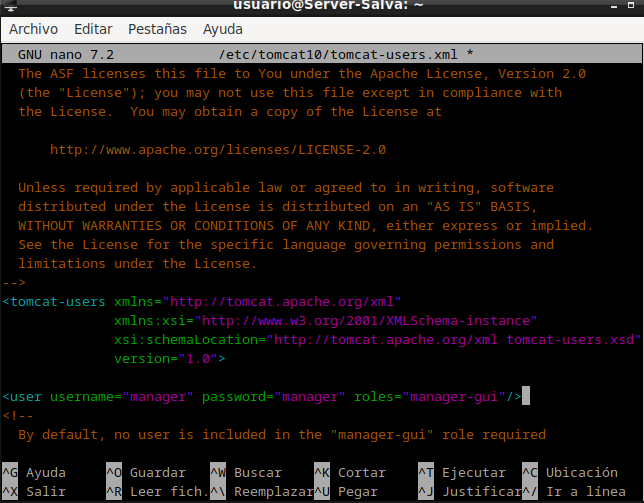

Después reiniciamos Tomcat y vemos si el servicio está activo.

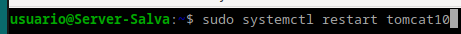

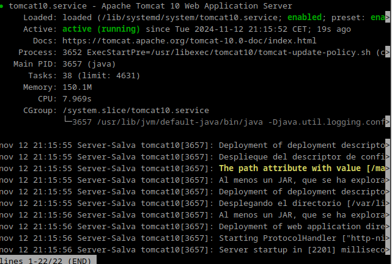

## Despliegue manual mediante la GUI de administración

Una vez hecho esto entramos a la GUI.

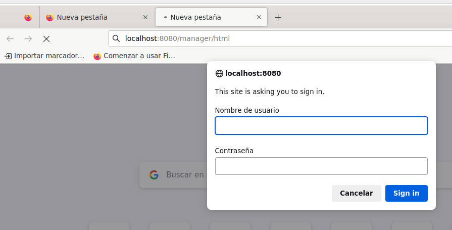

Una vez dentro buscamos la sección que nos permite desplegar aplicaciones y cargamos un archivo de ejemplo.

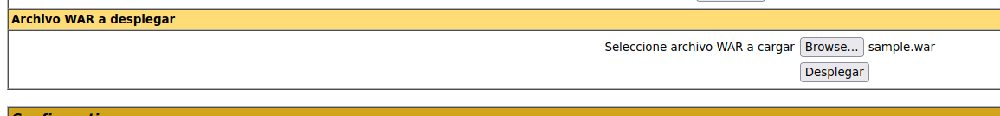

Podemos ver que se desplegó correctamente.

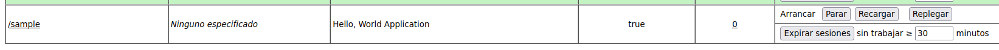

y que podemos acceder a la aplicación.

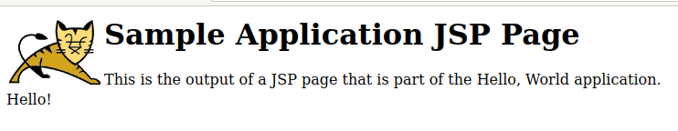

## Despliegue con Maven

Instalamos Maven.

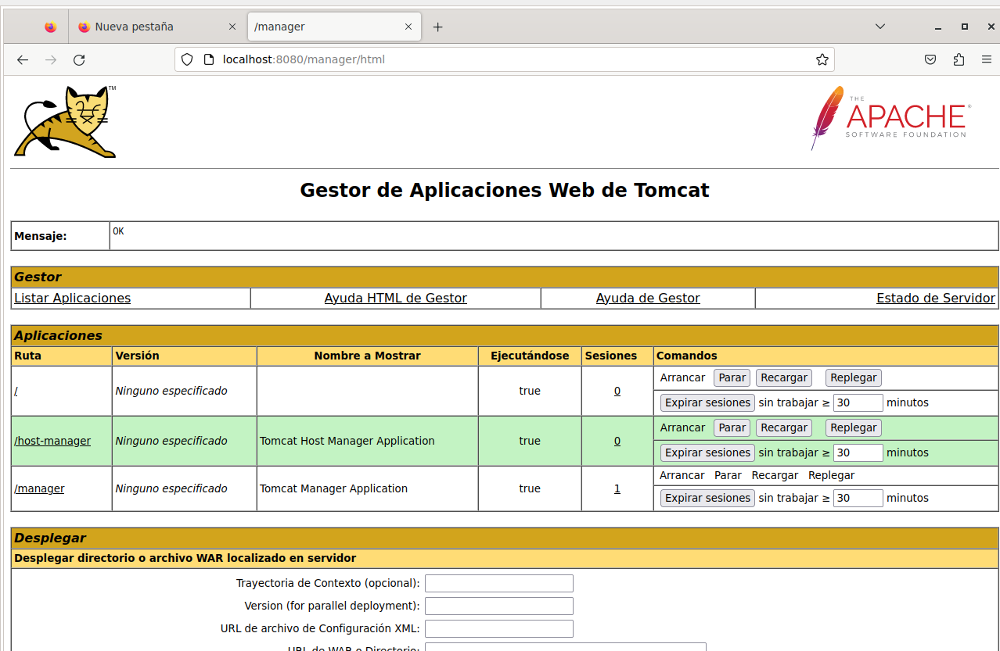

## Configuración de Maven

Añadimos ahora a tomcat un usuario para Maven.

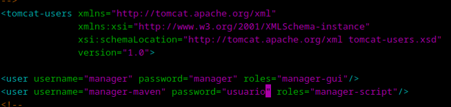

Y configuramos Maven para que pueda desplegar en Tomcat.

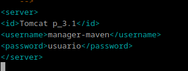

Por último modificamos el POM del proyecto para que Maven pueda desplegarlo.

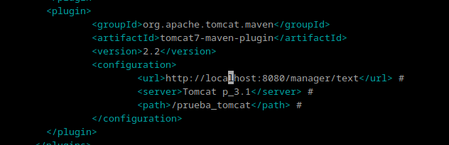

## Despliegue

Descargamos el proyecto de ejemplo.

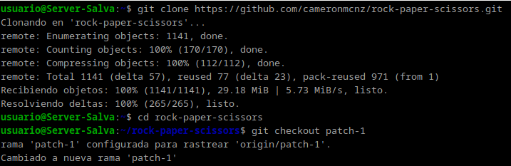

y nos cambiamos a la rama del parche 1

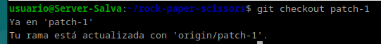

Después compilamos el proyecto.

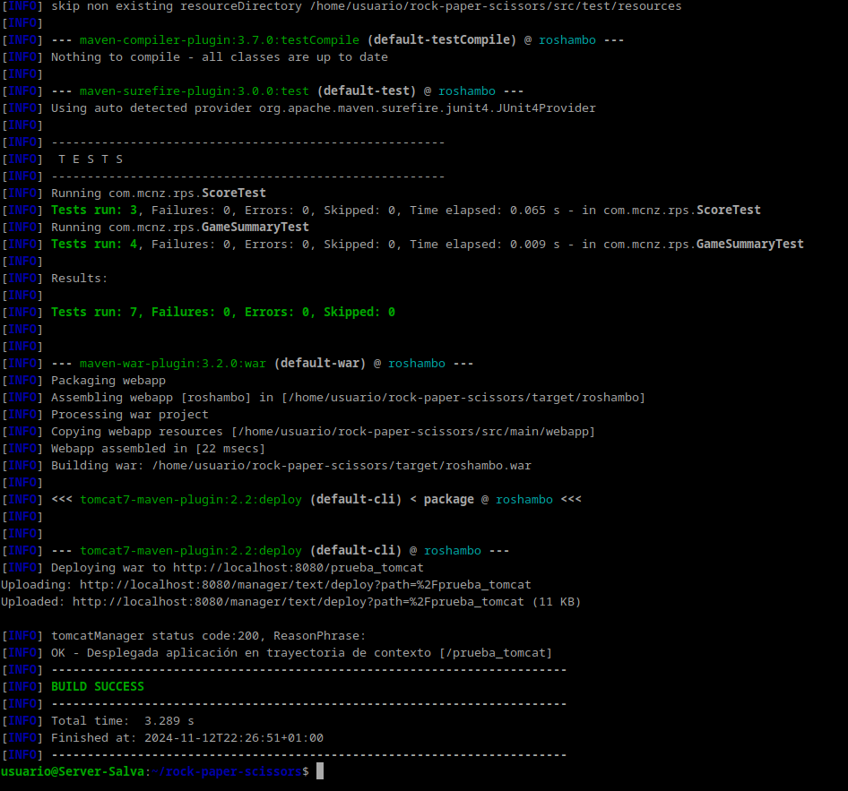

Podemos ver que efectivamente se ha creado el archivo WAR.

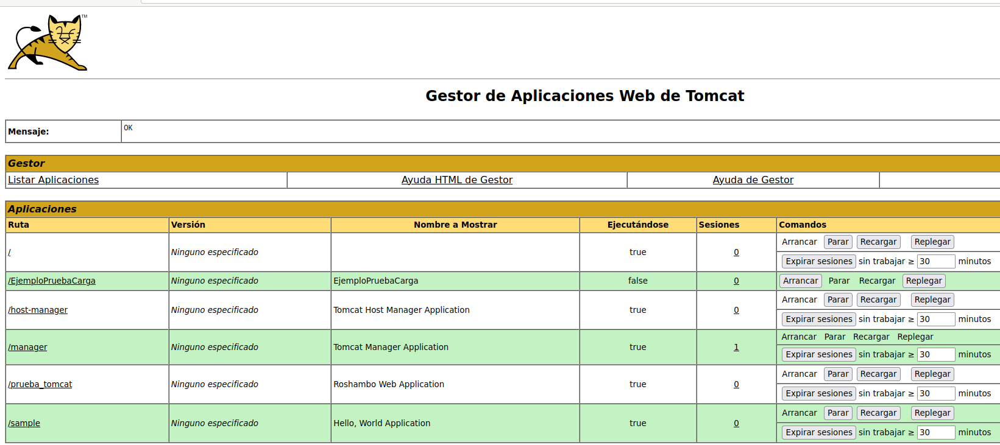

Y por último el proyecto funciona correctamente.

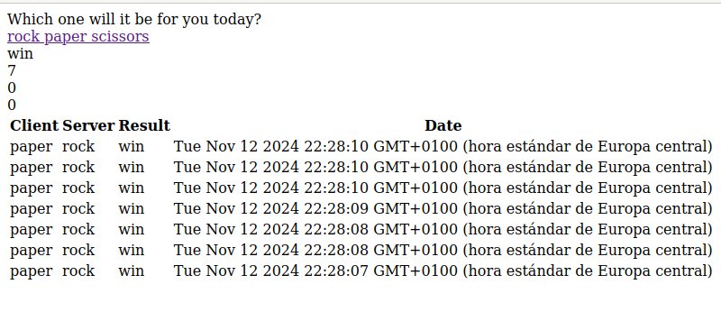

## Cuestiones

```Markdown
Habéis visto que los archivos de configuración que hemos tocado contienen contraseñas en texto plano, por lo que cualquiera con acceso a ellos obtendría las credenciales de nuestras herramientas.

En principio esto representa un gran riesgo de seguridad, ¿sabrías razonar o averigüar por qué esto está diseñado de esta forma?
```

En Tomcat, las contraseñas en texto plano (tomcat-users.xml) se usan por simplicidad en desarrollo, pero representan un gran riesgo si el archivo es accesible. Esto facilita la configuración rápida, pero expone credenciales sensibles. Para mitigar, usa cifrado, gestores de secretos y permisos estrictos. Evita estas prácticas en producción.
